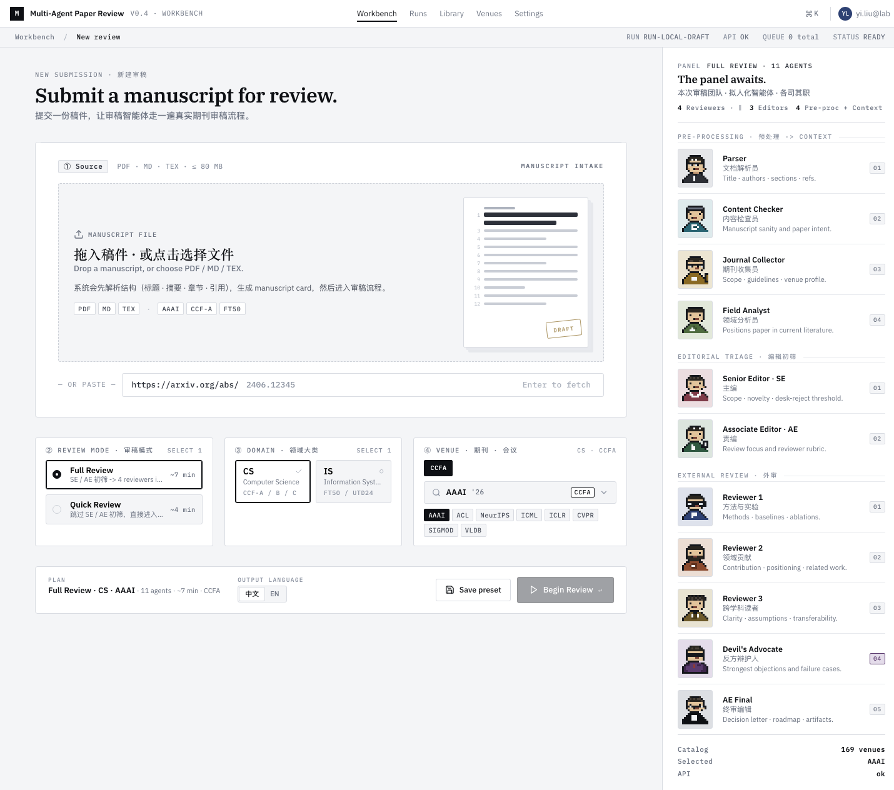
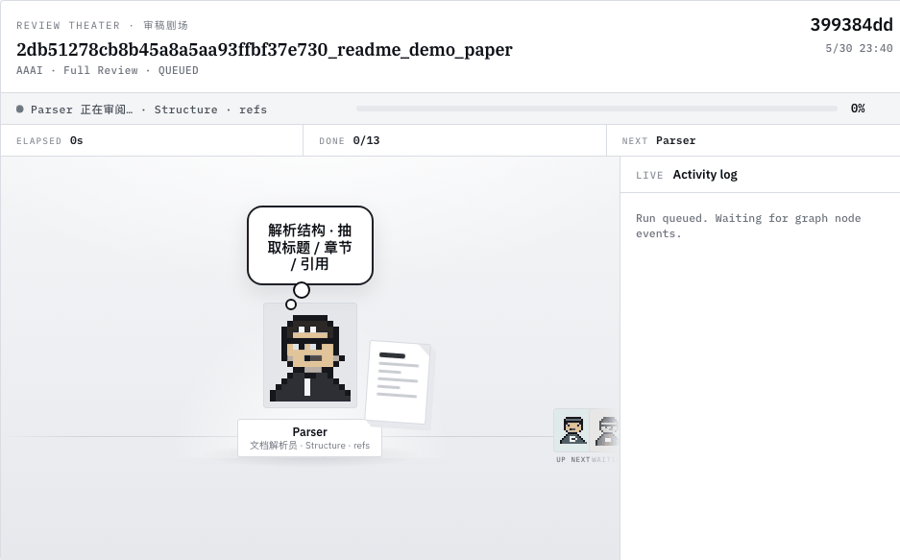
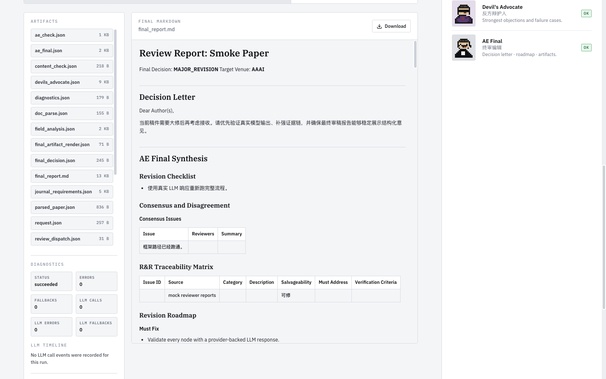

# Mutil-Agent Review

<p align="center">
  
  
  
  
  
  
</p>

A local-first multi-agent paper review workbench. It turns a manuscript into a
structured review run with parser, venue context, editor triage, multiple
reviewers, devil's advocate, final decision synthesis, diagnostics, and
downloadable artifacts.

The previous Coze/Vibe implementation is archived under
`reference/legacy-coze-review/`. Active development now lives in `src/`,
`frontend/`, `prompts/`, `venues/`, and `configs/`.

## Preview

<p align="center">
  
</p>

<p align="center">
  
</p>

<p align="center">
  
</p>

## What It Does

- Runs a LangGraph review workflow from manuscript intake to final report.
- Supports PDF, Markdown, and TeX inputs through replaceable parser adapters.
- Uses Markdown prompts and venue profiles as readable, versionable context.
- Routes model calls through `configs/llm.yaml`, while provider keys stay in local `.env`.
- Provides a FastAPI backend and a React workbench for uploads, progress, reports, and artifact management.
- Stores generated reports, diagnostics, and node artifacts locally under `data/`.
- Includes a mock LLM mode, so the full workflow can be smoke-tested without external API keys.

## Quick Start

```bash
uv venv
uv sync
cp .env.example .env
.venv/bin/python -m src.cli doctor
.venv/bin/python -m src.cli venue-catalog
```

Run a local mock review:

```bash
.venv/bin/python -m src.cli review paper.md \
  --mode QUICK_REVIEW \
  --venue-domain CS \
  --venue-collection CCFA \
  --venue-code AAAI \
  --output-language zh
```

The default `LLM_PROVIDER=mock` makes the system runnable without API keys. To
use real providers, set `LLM_PROVIDER=router`, fill credentials in `.env`, and
edit model routing in `configs/llm.yaml`.

## Full-Stack Development

Run backend and frontend separately:

```bash
scripts/dev-backend.sh
scripts/dev-frontend.sh
```

Or run both:

```bash
scripts/dev-fullstack.sh
```

Open:

```text
http://127.0.0.1:5173
```

## Architecture

```text
frontend/                React workbench
src/api/                 FastAPI boundary
src/services/            application services and local job runner
src/graphs/              LangGraph topology and nodes
src/core/                domain models, venues, output schemas
src/infra/               parser, LLM router, renderer, settings adapters
src/ports/               replaceable tool contracts
prompts/                 Markdown prompts
venues/                  venue requirements and venue profiles
configs/llm.yaml         model registry and prompt call parameters
data/                    local runtime data, ignored by Git
```

Main review execution goes through `src.graphs.graph.main_graph`.

## Verification

Run the lightweight checks before pushing framework changes:

```bash
.venv/bin/python -m unittest discover tests
.venv/bin/python -m src.cli doctor
npm --prefix frontend run build
scripts/check-api-contract.sh
```

Browser smoke checks are available for the frontend:

```bash
scripts/check-frontend-smoke.sh
scripts/check-frontend-command-smoke.sh
scripts/check-frontend-desktop-smoke.sh
```

## Privacy

Local secrets and generated artifacts are intentionally ignored:

- `.env`, `.env.*`
- `.venv/`, `node_modules/`, `frontend/dist/`
- `data/`, `runs/`, `artifacts/`, `outputs/`, `uploads/`
- local logs, databases, and generated JSONL traces

Use `.env.example` as the safe template. Do not commit real provider keys,
uploaded papers, or generated review outputs.
